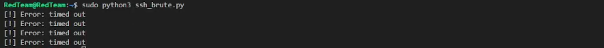
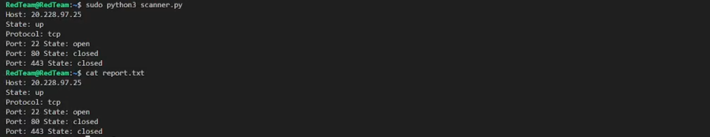
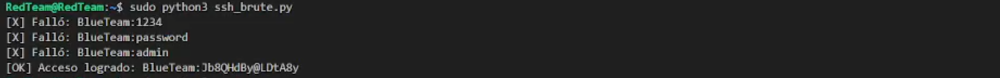
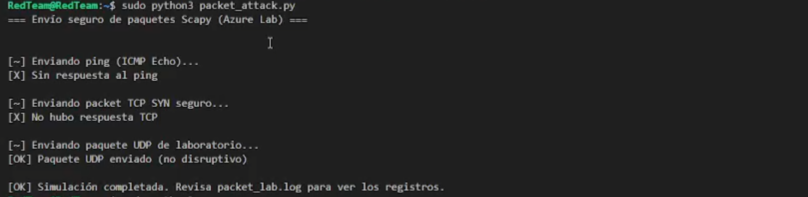

# Red Team - Ataque y Evaluación de Seguridad

## Propósito
Este módulo documenta las herramientas, técnicas y procedimientos utilizados por el **Red Team** para:
- Simular ataques reales de ciberseguridad.
- Identificar debilidades en la configuración de la VM del Blue Team.
- Documentar hallazgos y proponer mejoras.
- Automatizar escaneos y ataques con Python.

---

## Roles y Responsabilidades
- Ejecutar ataques controlados en un entorno seguro.
- Evaluar la postura de seguridad de la máquina virtual objetivo.
- Probar credenciales y configuraciones expuestas.
- Generar reportes claros de vulnerabilidades encontradas.

---

## Requisitos Técnicos
- Python 3
- Módulos: `nmap`, `scapy`, `paramiko`, `os`, `subprocess`, `logging`
- Acceso a una VM en la misma red que el Blue Team
- Opcional: **Azure CLI** para gestión de recursos

---

## Scripts Ofensivos

| Script            | Función principal |
|-------------------|------------------|
| `scanner.py`      | Escaneo de puertos y servicios usando Nmap desde Python. |
| `packet_attack.py`| Sniffing y ataques ARP/DNS spoofing con Scapy. |
| `ssh_brute.py`    | Ataque de diccionario al servicio SSH usando Paramiko. |
| `report.md`       | Documentación detallada de hallazgos y recomendaciones. |

---

## Instrucciones de Ejecución

1. Escaneo de puertos y servicios
   sudo python3 scanner.py

2.  Ataques de red (Sniffing y Spoofing)
    sudo python3 packet_attack.py
    - Captura paquetes TCP.
    - Simula ataques ARP/DNS spoofing.
2.  Fuerza bruta SSH
    python3 ssh_brute.py
    - Requiere diccionario de contraseñas.
    - Intenta acceso por fuerza bruta al puerto 22.

    Evaluación de la ejecucuión
        - Acceso no autorizado a la VM del Blue Team.
        - Identificación de puertos inseguros o servicios expuestos.
        - Captura de tráfico sensible.
        - Documentación clara de vulnerabilidades y recomendaciones.
    
    Estructura del Directoriored_team/
    │
    ├── scanner.py        # Escaneo de puertos y servicios
    ├── packet_attack.py  # Sniffing y ARP/DNS spoofing
    ├── ssh_brute.py      # Ataque de fuerza bruta SSH
    └── report.md         # Informe de hallazgos y recomendaciones

Buenas Prácticas
    - No ejecutar ataques fuera del entorno controlado.
    - Documentar cada paso y resultado.
    - Validar que las herramientas estén correctamente instaladas.
    - Apagar la VM cuando no esté en uso para conservar créditos de Azure.

## Evidencias de ejecución
### Firewall activo (BlueTeam)
`scanner.py` Al correrlo con el firewall activo tardó mucho en ejecutra, por ende el firewall estaba actuando para evitar el escaneo de puertos vulnerables. 

`ssh_brute.py` El firewall evita respuestas del ataque

### Firewall desactivado (BlueTeam)
`scanner.py` 

`ssh_brute.py` 

`packet_attack.py` 